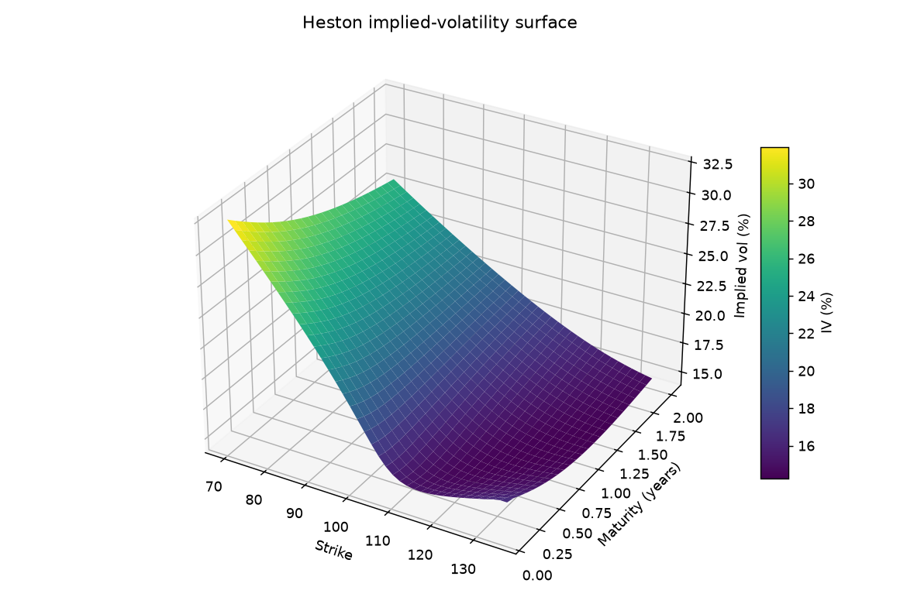
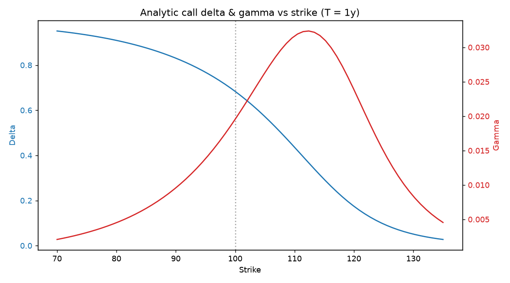
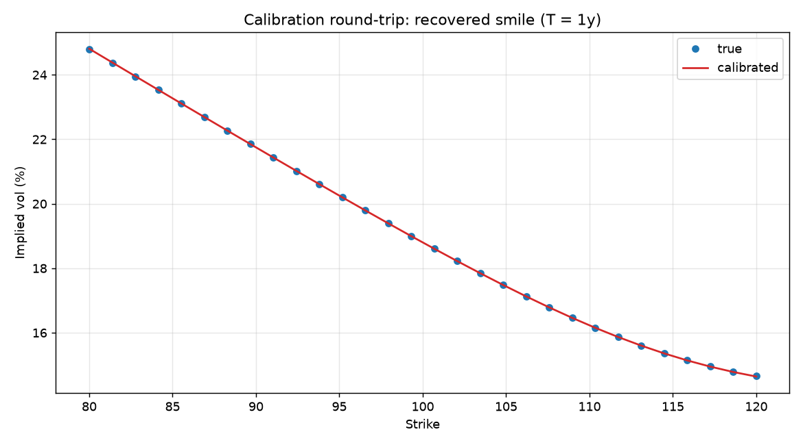
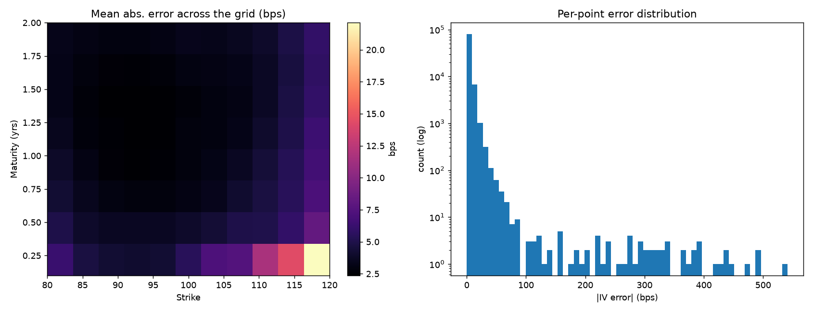
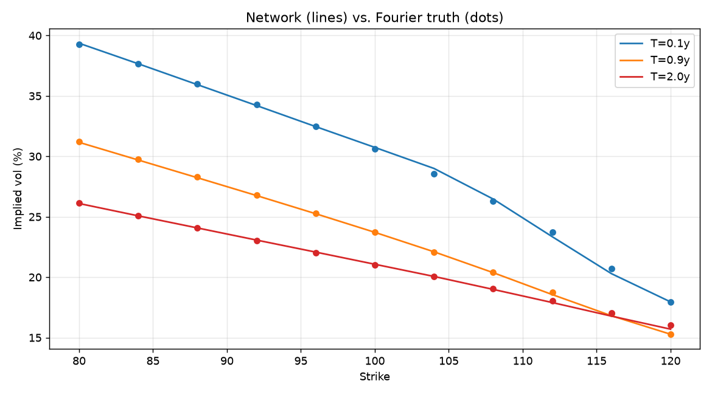
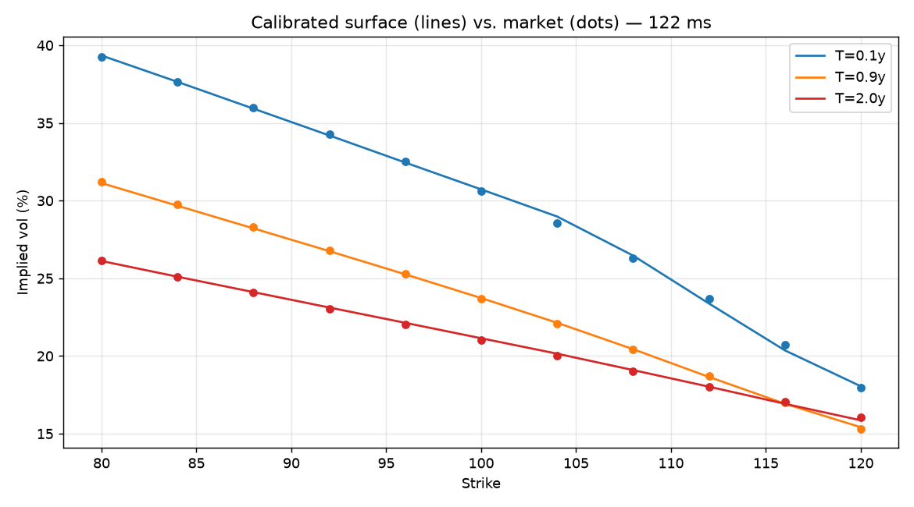

# Heston Model — Pricing & Calibration

A modern **C++20** library for pricing European options under the **Heston stochastic-volatility model** and calibrating the model to market data. It ships two independent pricing engines (a Carr–Madan Fourier pricer and a Monte Carlo simulator), Black–Scholes / implied-vol utilities, and two from-scratch optimizers (Nelder–Mead and CMA-ES) driving two calibration workflows.

No third-party runtime dependencies — only the C++ standard library. The unit tests use a vendored copy of [doctest](https://github.com/doctest/doctest) (header-only, included in-tree).

---

## The model

The Heston model lets the instantaneous variance of the underlying be random and mean-reverting, rather than the constant volatility assumed by Black–Scholes. Under the risk-neutral measure:

```
dS_t = (r - q) S_t dt + sqrt(v_t) S_t dW_t^S
dv_t = kappa (theta - v_t) dt + sigma sqrt(v_t) dW_t^v
d<W^S, W^v>_t = rho dt
```

It is described by five parameters (`heston::HestonParams`):

| Parameter | Symbol | Meaning |
|-----------|--------|---------|
| `v0`      | v₀     | initial instantaneous variance |
| `kappa`   | κ      | mean-reversion speed of variance |
| `theta`   | θ      | long-run variance |
| `sigma`   | σ      | volatility of variance ("vol of vol") |
| `rho`     | ρ      | correlation between the price and variance shocks (drives the skew) |

`HestonParams` also validates itself (`is_valid_basic()`) and reports the **Feller condition** `2·κ·θ ≥ σ²` via `satisfies_feller()`, which guarantees the variance process stays strictly positive.

---

## Features

- **Heston characteristic function** — "Little Heston Trap" formulation for numerical stability (`HestonCharacteristicFunction`).
- **Fourier pricer** — Carr–Madan damped-transform pricing with Simpson integration (`HestonFourierPricer`). Fast and deterministic; the workhorse for calibration.
- **Monte Carlo pricer** — full-truncation Euler, Milstein, and Andersen **QE** variance schemes, with antithetic variates and standard-error reporting (`HestonMonteCarloPricer`).
- **GPR surrogate pricer** — a machine-learning engine (`GprPricer`) that learns the Heston price from either pricer over a box in `(K, T, v0, κ, θ, σ, ρ)` and then prices new points with a **Gaussian-process regression** (`GaussianProcessRegressor`; ARD squared-exponential kernel, hyperparameters fit by CMA-ES, own from-scratch Cholesky in `utils/linalg.hpp`). It implements the same `IVanillaPricer` interface (drop-in engine), returns puts by put–call parity, and reports its predictive standard deviation through `PriceDiagnostics`. Follows De Spiegeleer, Madan, Reyners & Schoutens (2018), *Machine Learning for Quantitative Finance*.
- **Volatility toolkit** — Black–Scholes price, closed-form Greeks (delta, gamma, vega, theta, rho), and a robust implied-vol solver (bracketing + bisection with a Newton polish).
- **Greeks** — two routes:
  - a model-agnostic **finite-difference engine** (`compute_greeks_fd`) giving delta, gamma, theta and rho against *any* `IVanillaPricer`, plus the five Heston parameter sensitivities (`compute_param_sensitivities_fd` — the "vega bucket");
  - **semi-analytic** delta/gamma/rho on the Fourier pricer (`analytic_greeks`), obtained by differentiating the Carr–Madan integral under the integral sign (one quadrature pass for price + Greeks).
  Both are validated against the closed-form Black–Scholes Greeks and put–call parity.
- **Python bindings** — a `pybind11` module (`heston`) exposing the pricers, implied vol, Greeks and calibration, plus a demo notebook that plots the implied-vol surface, the Greek profiles and a calibration round-trip.
- **Deep-learning volatility** — a PyTorch neural network (`deep_calibration/`) that learns the map *Heston parameters → implied-vol surface* on a fixed 8×11 grid, trained offline against the Fourier engine, enabling **calibration by network inversion in milliseconds**. Reproduces Horvath, Muguruza & Tomas (2019), *Deep Learning Volatility* — the grid/image-based counterpart to the (pointwise) GPR pricer.
- **Calibration** — fit the five parameters to a set of market quotes:
  - to **implied-vol** quotes via Nelder–Mead (`calibrate_heston_to_iv`),
  - to **price** quotes via CMA-ES (`calibrate_heston_to_prices_cmaes`), with an optimization trace and final residuals.
- **Unconstrained reparameterization** — calibration optimizes in ℝ⁵ using `exp`/`tanh` transforms (`param_transform.hpp`), so positivity of `v0, κ, θ, σ` and `ρ ∈ (-1, 1)` hold automatically.
- **Typed errors** — all failures throw `heston::InvalidInput` or `heston::NumericFailure` (both derive from `heston::HestonError : std::runtime_error`).

---

## Requirements

- A **C++20** compiler (MSVC 2019+, GCC 10+, or Clang 12+)
- **CMake ≥ 3.20**

> **Windows note:** the build only needs a C++20 compiler on the `PATH`. If you don't have Visual Studio, the quickest route is [MSYS2](https://www.msys2.org/): install it, then from the *UCRT64* shell run
> `pacman -S --needed mingw-w64-ucrt-x86_64-gcc mingw-w64-ucrt-x86_64-cmake mingw-w64-ucrt-x86_64-ninja`
> and build with `-G Ninja`. This project is developed and tested against GCC 16 (C++20).

## Building

```bash
git clone https://github.com/VsevolodRakita/heston_model_pricing_and_calibration.git
cd heston_model_pricing_and_calibration
cmake -S . -B build -DCMAKE_BUILD_TYPE=Release
cmake --build build
```

This produces the static library **`heston_core`** plus the test executables. Building the tests is on by default; turn it off with `-DHESTON_BUILD_TESTS=OFF`.

## Running the tests

```bash
cd build
ctest --output-on-failure
```

Tests are labelled, so you can select subsets — for example, skip the slow Monte Carlo / calibration suites:

```bash
ctest -L fast                 # fast tests only
ctest -LE slow                # everything except slow tests
```

Available labels include `fast`, `slow`, `vol`, `stability`, `monte_carlo`, `calibration`, and `ml`.

---

## Project layout

```
include/                     # public headers (installed interface)
  models/heston/             # HestonParams, Market, characteristic function
  products/                  # VanillaOption, OptionType
  pricers/                   # IVanillaPricer interface, FFT + Monte Carlo + GPR surrogate
  ml/                        # GaussianProcessRegressor (GPR surrogate core)
  vol/                       # Black–Scholes, implied vol
  greeks/                    # finite-difference Greeks engine
  optimization/              # Nelder–Mead, CMA-ES
  calibration/               # quotes, objectives, calibrators, reports
  utils/                     # errors, numerics, stats, rng, linalg (Cholesky)
src/                         # implementations (compiled into heston_core)
tests/                       # doctest-based unit tests (+ vendored doctest.h)
bindings/                    # pybind11 module (optional, -DHESTON_BUILD_PYTHON=ON)
notebooks/                   # Python demo notebook + generated figures
```

---

## Usage

### Price a European option (Fourier)

```cpp
#include "models/heston/market.hpp"
#include "models/heston/heston_params.hpp"
#include "products/vanilla_option.hpp"
#include "pricers/fft/heston_fourier_pricer.hpp"

using namespace heston;

Market       mkt{/*s0=*/100.0, /*r=*/0.02, /*q=*/0.0};
HestonParams params{/*v0=*/0.04, /*kappa=*/1.5, /*theta=*/0.04,
                    /*sigma=*/0.5, /*rho=*/-0.7};
VanillaOption call{OptionType::Call, /*K=*/100.0, /*T=*/1.0};

HestonFourierPricer pricer;
double price = pricer.price(call, mkt, params);
```

### Cross-check with Monte Carlo

```cpp
#include "pricers/mc/heston_monte_carlo_pricer.hpp"

HestonMonteCarloPricer mc;                       // QE scheme, antithetic, by default
auto res = mc.price_with_error(call, mkt, params);
// res.price, res.std_error, res.n_used
```

Both pricers implement the common `IVanillaPricer` interface (`price`, `priceBatch`), so calibration and client code can swap engines transparently.

### Recover implied volatility

```cpp
#include "vol/implied_vol.hpp"

double iv = implied_vol_black_scholes(call, mkt, price);
```

### Compute Greeks

The Greeks engine works against any pricer, so the same call gives you Fourier or Monte Carlo risk:

```cpp
#include "greeks/greeks.hpp"

HestonFourierPricer pricer;

Greeks g = compute_greeks_fd(pricer, call, mkt, params);
// g.delta, g.gamma, g.theta, g.rho  (sensitivities to spot, time, rate)

HestonParamSensitivities s = compute_param_sensitivities_fd(pricer, call, mkt, params);
// s.d_v0 (the Heston vega), s.d_kappa, s.d_theta, s.d_sigma, s.d_rho
```

For a constant-volatility benchmark, the closed-form Black–Scholes Greeks are also available directly (`black_scholes_delta`, `_gamma`, `_vega`, `_theta`, `_rho` in `vol/black_scholes.hpp`).

### Calibrate to implied-vol quotes (Nelder–Mead)

```cpp
#include "calibration/iv_quote.hpp"
#include "calibration/calibrator.hpp"

std::vector<IvQuote> quotes = /* market {option, iv} pairs */;

HestonParams        guess{0.04, 1.0, 0.04, 0.5, -0.5};
CalibrationSettings settings;                    // default Nelder–Mead + Fourier pricer
CalibrationResult   fit = calibrate_heston_to_iv(quotes, mkt, guess, settings);
// fit.params, fit.loss, fit.iters
```

### Calibrate to price quotes (CMA-ES)

```cpp
#include "calibration/price_quote.hpp"
#include "calibration/calibrator_price.hpp"

std::vector<PriceQuote> quotes = /* market {option, price} pairs */;

HestonParams             guess{0.04, 1.0, 0.04, 0.5, -0.5};
PriceCalibrationSettings settings;               // default CMA-ES + Fourier pricer
CalibrationReport        report =
    calibrate_heston_to_prices_cmaes(quotes, mkt, guess, settings);
// report.params, report.loss, report.iters,
// report.trace (per-iteration path), report.final_residuals
```

> Calibration runs on the deterministic Fourier pricer and searches over the unconstrained ℝ⁵ parameterization, keeping every candidate a valid Heston parameter set.

### Train and use the GPR surrogate pricer

```cpp
#include "pricers/fft/heston_fourier_pricer.hpp"
#include "pricers/ml/gpr_pricer.hpp"

using namespace heston;

Market mkt{/*s0=*/100.0, /*r=*/0.02, /*q=*/0.01};

GprPricer::Config cfg;
cfg.reference = mkt;                                   // the surrogate is trained for this market
cfg.box = GprPricer::Box{/*K*/ 80, 120,  /*T*/ 0.3, 1.5,  /*v0*/ 0.02, 0.08,
                         /*kappa*/ 1, 3, /*theta*/ 0.02, 0.08,
                         /*sigma*/ 0.2, 0.6, /*rho*/ -0.8, -0.2};
cfg.n_train = 1500;

GprPricer gpr(cfg);
gpr.train(HestonFourierPricer{});                      // offline: learn from the Fourier engine

// Now price fast for any point in the box (drop-in IVanillaPricer).
VanillaOption call{OptionType::Call, 100.0, 1.0};
HestonParams  p{0.04, 2.0, 0.04, 0.4, -0.5};
double px  = gpr.price(call, mkt, p);
double sd  = gpr.diagnostics().stdError;               // GP predictive std for that price
```

---

## Python bindings

The C++ engine is exposed to Python through a `pybind11` module. Enable it at
configure time (requires `pybind11` and a Python development install):

```bash
cmake -S . -B build -G Ninja -DCMAKE_BUILD_TYPE=Release -DHESTON_BUILD_PYTHON=ON
cmake --build build --target heston_py
```

This produces an importable `heston` module in `build/bindings/`. From there:

```python
import heston as h

mkt    = h.Market(s0=100.0, r=0.03, q=0.01)
params = h.HestonParams(v0=0.04, kappa=1.5, theta=0.05, sigma=0.6, rho=-0.7)
fp     = h.HestonFourierPricer(alpha=1.5, u_max=250.0, n_intervals_even=12000)

call = h.VanillaOption(h.OptionType.Call, 100.0, 1.0)
px   = fp.price(call, mkt, params)
g    = fp.analytic_greeks(call, mkt, params)   # g.price, g.delta, g.gamma, g.rho
iv   = h.implied_vol(call, mkt, px)
```

The notebook [`notebooks/heston_demo.ipynb`](notebooks/heston_demo.ipynb) builds a
Heston implied-vol surface, plots the analytic Greek profiles, and runs a
calibration round-trip (recovering the parameters from synthetic prices):

| Implied-vol surface | Greeks vs strike | Calibration round-trip |
|:---:|:---:|:---:|
|  |  |  |

## Deep-learning volatility

A neural pricing map for Heston, after Horvath, Muguruza & Tomas (2019). A small
feed-forward network (4 hidden layers × 30 ELU units) learns *parameters → the
8×11 implied-vol grid*, trained offline against the Fourier engine; calibration
then inverts the fast, differentiable network in milliseconds. The whole
pipeline lives in [`deep_calibration/`](deep_calibration/) (see its README for
the two-environment workflow) and is demonstrated in
[`notebooks/deep_calibration_demo.ipynb`](notebooks/deep_calibration_demo.ipynb).

On a held-out test set the network approximates the surface to **~10 bps RMSE**,
calibrates a full surface in **~100 ms**, and prices **~10⁵× faster** than the
Fourier engine:

| Approximation error | Network vs. Fourier | Calibration (≈100 ms) |
|:---:|:---:|:---:|
|  |  |  |

This is the grid/image-based **neural** counterpart to the pointwise **GPR**
surrogate above — two takes on replacing a slow pricer with a fast learned map.

## Numerical notes & conventions

- **Rates and yields** are continuously compounded; `q` is a continuous dividend yield / cost of carry.
- **Maturities** `T` are in years.
- The Fourier pricer values a call directly and obtains puts by **put–call parity**; optional guardrails floor the price and cap it at a multiple of spot.
- The QE Monte Carlo scheme follows Andersen's quadratic-exponential moment-matching, with the Euler and Milstein schemes using full truncation of the variance.
- Inputs are validated up front; invalid inputs or numerical breakdowns raise the typed exceptions above rather than returning silent `NaN`s.

---

## License

Released under the **MIT License** — © 2026 Vsevolod Rakita, Ph.D. See [LICENSE](LICENSE).
